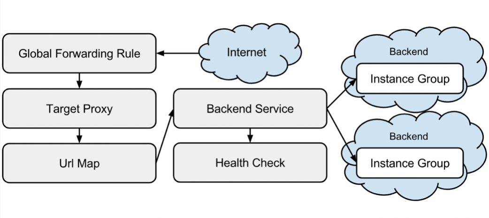

# Load Balancing avec GCE

### Objectifs

Ici on cherche à reproduire l'architecture de **load balancing cross region** suivante.



Les tâches demandées sont les suivantes : 
- Déployer une application avec GCE
- Créer un groupe de Vms
- Mettre en place le load balancing

Tout commence par une requête lancée depuis un client. Cette requête passe par un service de **Forwarding Rules**. Ce service permet de gérer le traffic par adresse IP, port et protocol et le renvoyer à un **Target Proxy** de répartition de charge qui va ensuite transmettre le traffic à un groupe d'instance contenant nos VMs par l'utilisation d'un **URL Map**. L'URL Map permet d'associer un type de requête à un certain **backend service**.

Le but ici est d'avoir plusieurs instances disponible dans des régions différentes pour permettre de balancer la charge en fonction de la situation géographique du client.


### 1. Création de paire d'instances
<hr>

On commence par créer deux paires d'instances dans des régions différentes, une aux usa et une en europe.<br>
On donne à ces instance un script de démarrage qui lance un serveur apache avec une page d'index différente pour chaque instance.

```
gcloud compute instances create instance-1 \
    --image-family=debian-9 \
    --image-project=debian-cloud \
    --machine-type=g1-small \
    --metadata app-location=europe-west4-a \
    --metadata-from-file startup-script=reg1.sh \
--zone europe-west4-a \
    --tags http-server

gcloud compute instances create instance-2 \
    --image-family=debian-9 \
    --image-project=debian-cloud \
    --machine-type=g1-small \
    --metadata app-location=europe-west4-a \
    --metadata-from-file startup-script=reg1.sh \
    --zone europe-west4-a \
    --tags http-server
```

Puis on créé une deuxième paire dans une autre région : 

```
gcloud compute instances create instance-3 \
    --image-family=debian-9 \
    --image-project=debian-cloud \
    --machine-type=g1-small \
    --metadata app-location=us-west2-a \
    --metadata-from-file startup-script=reg1.sh \
    --zone us-west2-a \
    --tags http-server

gcloud compute instances create instance-4 \
    --image-family=debian-9 \
    --image-project=debian-cloud \
    --machine-type=g1-small \
    --metadata app-location=us-west2-a \
    --metadata-from-file startup-script=reg1.sh \
    --zone us-west2-a \
    --tags http-server
```

Chaque instance est identifiée par un **tag** appelé **http-tag**, ce tag va nous servir à autoriser le traffic HTTP sur les VMs.

### 2. Règle de pare-feu pour le traffic
<hr>

On a maintenant besoin d'autoriser le traffic externe sur nos VM. Pour ça on va créer une règle de pare-feu permettant d'autoriser le traffic HTTP depuis toutes les sources. On utilise donc le tag **http-tag** créé avant pour autoriser toutes les connections tcp sur le port 80.

```
gcloud compute firewall-rules create www-firewall \
    --target-tags http-server --allow tcp:80
```

On récupère maintenant les IPs de nos machines : 

<pre>gcloud compute instances list</pre>

Et on y accède via un browser ou un curl.

### 3. Services pour la répartition de charge
<hr>

Maintenant que nos instances fonctionnent correctement et qu'on y a accès, on va mettre en place les services qui vont permettre la répartition de charge sur les 4 VMs.
La première chose à faire est de réserver des **IPV4/V6 statiques**.

```
gcloud compute addresses create lb-ip-cr \
    --ip-version=IPV4 \
    --global
    
gcloud compute addresses create lb-ipv6-cr \
	--ip-version=IPV6 \
	--global
```

On a ensuite besoin d'un groupe d'instance. Comme spécifié dans le TP introduction à GCE, les groupes d'instances peuvent nous permettre de connecter des VMs entre elles et sont ainsi utiles au load balancer pour connaitre les VMs à utiliser pour la répartition de la charge.

#### 3.1 Groupe d'instances

On créé donc deux groupes d'instances non gérés, un pour chaque région.

```
gcloud compute instance-groups unmanaged create us-resources-s --zone us-central1-b
gcloud compute instance-groups unmanaged create europe-resources-s --zone europe-west1-b
```

Et on ajoute maintenant nos VMs aux groupes d'instances.

```
gcloud compute instance-groups unmanaged add-instances us-resources-s \
    --instances instance-1, instance-2 \
    --zone us-central1-b
    
gcloud compute instance-groups unmanaged add-instances europe-resources-s \
    --instances instance-3, instance-4 \
    --zone europe-west1-b
```

#### 3.2 HTTP service

On va ensuite définir un service HTTP par instance et mapper un nom de port au port que l'on utilise.

```
gcloud compute instance-groups unmanaged set-named-ports us-resources-w \
    --named-ports http:80 \
    --zone us-central1-b

gcloud compute instance-groups unmanaged set-named-ports europe-resources-w \
    --named-ports http:80 \
    --zone europe-west1-b
```

#### 3.3 Health check

Pour nous permettre de s'assurer que notre architecture fonctionne on met en place un **health check**.

```
gcloud compute health-checks create http http-basic-check \
    --port 80
```

#### 3.4 Backend Service

Un backend service est une ressource permettant de configurer un load balancer. On créé donc ce service en spécifiant plusieurs paramètres : 

- Le protocol utilisé, **HTTP** pour nous
- Un heal check, **http-basic-check**

```
gcloud compute backend-services create web-map-backend-service \
    --protocol HTTP \
    --health-checks http-basic-check \
    --global
```

On ajoute aussi nos groupes d'instances en tant que backends au backend service. Le backend service nous permet de définir la capacité des groupes d'instances qu'il contient. Pour notre cas, on utilise le balancing mode **CPU utilization** avec la valeur max (80%) et une capacité de répartition à 1. 

```
gcloud compute backend-services add-backend web-map-backend-service \
    --balancing-mode UTILIZATION \
    --max-utilization 0.8 \
    --capacity-scaler 1 \
    --instance-group us-resources-w \
    --instance-group-zone us-central1-b \
    --global

gcloud compute backend-services add-backend web-map-backend-service \
    --balancing-mode UTILIZATION \
    --max-utilization 0.8 \
    --capacity-scaler 1 \
    --instance-group europe-resources-w \
    --instance-group-zone europe-west1-b \
    --global
```

#### 3.5 Url map & Http proxy

On se sert d'une **URL map** pour rediriger toutes les requêtes rentrantes sur toutes les instances.

```
gcloud compute url-maps create web-map \
    --default-service web-map-backend-service
```

Puis un proxy HTTP pour diriger les requêtes vers l'URL map.

```
gcloud compute target-http-proxies create http-lb-proxy \
    --url-map web-map
```


#### 3.6 Forwarding rules

On a maintenant besoin de l'adresse de notre load balancer pour créer deux **forwarding rules** pour diriger les requêtes entrantes au proxy, une pour IPV4 et l'autre pour IPV6. 

<pre>gcloud compute addresses list</pre>

```
gcloud compute forwarding-rules create http-cr-rule \
    --address [IPV4_ADDRESS] \
    --global \
    --target-http-proxy http-lb-proxy \
    --ports 80

gcloud compute forwarding-rules create http-cr-ipv6-rule \
    --address [IPV6_ADDRESS] \
    --global \
    --target-http-proxy http-lb-proxy \
    --ports 80
```


### 4. Observer le traffic
<hr>

Maintenant que tous les services sont configurés on peut commencer à envoyer du traffic aux règles de forwarding et regarder si le traffic se disperse sur nos instances.

On a d'abord besoin de l'adresse de nos règles : 

<pre>gcloud compute forwarding-rules list</pre>

Et on utilise curl pour tester nos services. On essaye IPV4 et IPV6. Pour la V6 on doit mettre des brackets [] autour de l'adresse.

```
curl http://IPv4_ADDRESS
curl -g -6 "http://[IPv6_ADDRESS]/"
```

Nous devrions voir une réponse venant de la région étant la plus proche de notre client (europe-west). On peut utiliser un proxy / VPN pour simuler une requête venant d'une autre région afin de s'assurer du bon fonctionnement du load balancer. Vous pouvez aussi vous connecter à l'une des VMs d'une région des deux régions et curl sur une VM d'une région différente ...

### 5. Restreindre l'accès au service

Maintenant que tout fonctionne, on a besoin de couper les accès HTTP(S) depuis toutes les sources sauf sur le service du load balancer. Comme ça, on s'assure que le load balancer est notre seul point d'entrée. Pour cela on modifie les règles de pare-feu pour que le traffic allant sur les instances ne puisse venir que du load balancer.

```
gcloud compute firewall-rules create allow-lb-and-healthcheck \
    --source-ranges 130.211.0.0/22,35.191.0.0/16 \
    --target-tags http-server \
    --allow tcp:80
```

Puis on supprime la règle qui autorise le traffic HTTP(S) depuis d'autres sources.

<pre>gcloud compute firewall-rules delete www-firewall</pre>

Enfin, on teste si le load balancer arrive à joindre nos instances mais que d'autres sources ne le peuvent pas.

<pre>gcloud compute addresses list</pre>

Pour trouver l'adresse de nos règles de forwarding.
Et on curl le load balancer.

<pre>curl http://IP_ADDRESS</pre>

Maintenant on teste avec l'adresse des VMs.

<pre>gcloud compute instances list</pre>

<pre>curl http://EXTERNAL_IP</pre>

Et voilà ! Si le curl ne renvoie aucune réponse en tapant sur l'adresse d'une VM c'est que notre architecture scalable est parfaitement mise en place. GG !


### 6. Suppression

La suppression des services se fait dans l'ordre inverse de leur création. En reprenant l'architecture sur l'image ci-dessus on commence par le target proxy et on finit par les instances.
